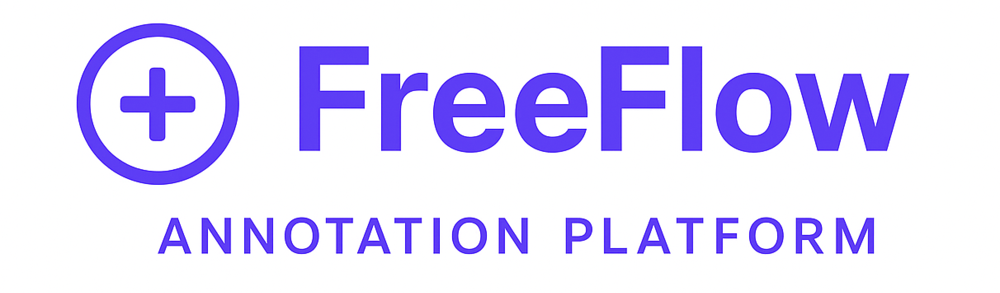

<div align="center">
  
  
  # FreeFlow Annotation Platform
  
  ### A comprehensive, Roboflow-like annotation platform for object detection
  **Built with Flask • Powered by YOLOv11 • Designed for Speed**
  
  [](https://www.python.org/downloads/)
  [](https://flask.palletsprojects.com/)
  [](https://github.com/ultralytics/ultralytics)
  [](LICENSE)
</div>

---

## 🌟 Key Features

### 📁 **Project Management**
- ✅ Create and manage unlimited projects
- ✅ Custom classes with color-coded visualization
- ✅ Project thumbnails and metadata
- ✅ Project settings and deletion with warnings
- ✅ Class statistics and annotation counts

### 📤 **Data Management**
- ✅ Batch image upload with drag & drop
- ✅ **PDF parsing** with automatic page extraction (pypdfium2)
- ✅ Real-time PDF processing progress with SocketIO
- ✅ Automatic image resizing (max 2000px on longest side)
- ✅ Image filtering: All, Annotated, Unannotated
- ✅ **Bulk image selection and deletion**
- ✅ Grid view with customizable pagination (default 20 images/page)
- ✅ **Roboflow dataset import** with API integration

### 🎨 **Advanced Annotation Interface**
- ✅ Interactive canvas-based annotation with zoom & pan
- ✅ Bounding box drawing, resizing, and dragging
- ✅ **Shift+Click** to draw over existing annotations
- ✅ **Auto-save on navigation** (enabled by default)
- ✅ **Continuous Label Assist** (enabled by default)
- ✅ Class selection with keyboard shortcuts (1-9)
- ✅ Annotation history with unlimited undo/redo
- ✅ Canvas transformations (zoom, pan, reset)

### 🤖 **Label Assist (YOLO-in-the-Loop)**
- ✅ Use external models from `output_models` folder
- ✅ Use trained models from previous training jobs
- ✅ Upload and manage custom models
- ✅ **Class mapping** for all model types
- ✅ Confidence threshold adjustment with live slider
- ✅ Persistent label assist mode across images
- ✅ Automatic annotation removal before assist
- ✅ Real-time predictions with bounding boxes

### 🏋️ **YOLOv11 Model Training**
- ✅ Train with latest **YOLOv11** architecture (nano, small, medium, large, x-large)
- ✅ **Train locally OR on Hugging Face Jobs** (cloud GPUs/TPUs)
- ✅ **Hugging Face Jobs integration** with hardware selection (T4, A10G, A100, TPUs)
- ✅ **Multiple simultaneous training jobs**
- ✅ **Dataset versioning** with train/val/test splits
- ✅ **Visual split slider** with color-coded sections
- ✅ **Random seed support** for reproducible splits
- ✅ Real-time training progress with SocketIO
- ✅ **Detailed loss metrics**: Box Loss, Class Loss, DFL Loss (train & validation)
- ✅ **Early stopping** - stop after current epoch and save model
- ✅ Interactive graphs: Loss, mAP@50, Precision/Recall, Learning Rate
- ✅ Automatic test set evaluation with per-class metrics
- ✅ Training job history with status indicators
- ✅ Job deletion and cancellation

### 📊 **Model Analysis & Deployment**
- ✅ **Dedicated model view page** with comprehensive metrics
- ✅ Training graphs and confusion matrices
- ✅ **Per-class evaluation metrics** (Precision, Recall, mAP@50)
- ✅ **Test set predictions** with bounding box visualization
- ✅ **Upload & test on new images** directly in model page
- ✅ Model download (.pt weights)
- ✅ Model deletion with file cleanup
- ✅ Use trained models for label assist in annotation

### 💾 **Database & Storage**
- ✅ SQLite database for local storage
- ✅ Single-user system (no authentication needed)
- ✅ Efficient schema with relationships
- ✅ Automatic migrations for schema updates
- ✅ Organized file structure for uploads and training outputs

---

## 🚀 Quick Start

### Installation

1. **Clone the repository:**
```bash
git clone https://github.com/wjbmattingly/freeflow
cd freeflow
```

2. **Create a virtual environment:**
```bash
conda create --name=freeflow python=3.12
conda activate freeflow # On Windows: venv\Scripts\activate
```

3. **Install dependencies:**
```bash
pip install -r requirements.txt
```

### Running the Application

```bash
python app.py
```

Open your browser and navigate to: **http://localhost:5000**

---

## 📖 Complete Workflow

### 1️⃣ Create a Project
- Click **"New Project"**
- Enter project name and select annotation group
- Choose **Object Detection** type
- Add custom classes with color coding
- Create project

### 2️⃣ Upload Data
**Option A: Upload Images/PDFs**
- Click **"📤 Upload Images"**
- Drag and drop images or PDF files
- Watch real-time progress for PDF processing
- Images automatically organized and tracked

**Option B: Import from Roboflow**
- Click **"🤖 Import from Roboflow"**
- Enter API key, workspace, project, and version
- Automatic class mapping and data import
- All annotations preserved

### 3️⃣ Annotate Images
- Click **"Annotate"** or filter by Annotated/Unannotated
- Select class from left sidebar (or press 1-9)
- Draw bounding boxes on images
- **Shift+Click** to draw over existing boxes
- Auto-save enabled by default
- Use arrow keys to navigate

### 4️⃣ Enable Label Assist (Optional)
- Click **"Label Assist"** button (active by default)
- Select model: External, Trained, or Custom
- Configure class mapping
- Adjust confidence threshold
- Enable **"Continuous Label Assist"** for automatic predictions
- Predictions appear when navigating images

### 5️⃣ Create Dataset Version
- Click **"Create Dataset Version"**
- Use visual slider to set train/val/test splits
- Click **🎲 Randomize** for new seed
- Enter version name and description
- Create versioned snapshot

### 6️⃣ Train YOLOv11 Model
- Click **"Train Model"**
- Enter model name
- Select size: Nano, Small, Medium, Large, or X-Large
- Choose dataset version (or use auto-split)
- Start training and monitor real-time progress
- Use **⏹️ Stop After Current Epoch** for early stopping

### 7️⃣ Analyze Results
- View training graphs and metrics
- Check per-class evaluation results
- Download confusion matrices
- Test on new images
- Download model weights
- Use trained model for label assist

---

## ⌨️ Keyboard Shortcuts

### Annotation Interface
| Shortcut | Action |
|----------|--------|
| **1-9** | Select class by number |
| **←** / **→** | Navigate to previous/next image |
| **Ctrl+S** | Save annotations (optional with auto-save) |
| **Ctrl+Z** | Undo last action |
| **Ctrl+Y** | Redo action |
| **Shift+Click** | Draw new box over existing annotation |
| **Delete** | Delete selected annotation |
| **Drag** | Move bounding box |
| **Drag corners** | Resize bounding box |

### Canvas Controls
| Action | Method |
|--------|--------|
| **Zoom In** | Mouse wheel up / Zoom+ button |
| **Zoom Out** | Mouse wheel down / Zoom- button |
| **Pan** | Click and drag (after zooming) |
| **Reset View** | Reset button |

---

## 📁 Project Structure

```
freeflow/
├── 📄 Core Application
│   ├── app.py                    # Main Flask application & routes
│   ├── models.py                 # SQLAlchemy database models
│   ├── routes.py                 # API endpoints (1500+ lines)
│   ├── training.py               # YOLOv11 training logic with callbacks
│   └── requirements.txt          # Python dependencies
│
├── 🎨 Frontend
│   ├── templates/
│   │   ├── base.html            # Base template with navigation
│   │   ├── index.html           # Landing page
│   │   ├── projects.html        # Projects list
│   │   ├── project.html         # Project data management
│   │   ├── annotate.html        # Annotation interface
│   │   ├── training.html        # Training dashboard
│   │   ├── model_view.html      # Model analysis page
│   │   ├── classes.html         # Class management
│   │   └── settings.html        # Project settings
│   │
│   └── static/
│       ├── css/
│       │   └── style.css        # Comprehensive styling
│       ├── js/
│       │   ├── main.js          # Shared utilities & API calls
│       │   ├── projects.js      # Projects page logic
│       │   ├── project.js       # Data management & uploads
│       │   ├── annotate.js      # Annotation canvas & tools
│       │   ├── training.js      # Training monitoring & charts
│       │   ├── model_view.js    # Model analysis & testing
│       │   └── classes.js       # Class editor
│       └── assets/
│           └── logo.png         # FreeFlow logo
│
├── 💾 Data Storage (auto-created)
│   ├── instance/
│   │   └── annotation_platform.db  # SQLite database
│   ├── uploads/                    # Organized by project_id
│   │   └── <project_id>/
│   │       └── *.jpg, *.png
│   ├── datasets/                   # YOLO format datasets
│   │   └── project_<id>_job_<id>/
│   │       ├── data.yaml
│   │       ├── train/
│   │       ├── val/
│   │       └── test/
│   ├── training_runs/              # Training outputs
│   │   └── <project_id>/
│   │       └── job_<id>/
│   │           ├── weights/
│   │           │   ├── best.pt
│   │           │   └── last.pt
│   │           ├── results.csv
│   │           ├── results.png
│   │           ├── confusion_matrix.png
│   │           └── ...
│   └── output_models/              # Custom uploaded models
│       └── *.pt
│
└── 📊 Generated Files
    ├── server.log              # Application logs
    └── runs/                   # YOLO validation outputs
```

---

## 🗄️ Database Schema

### Core Tables
- **`project`**: Project metadata, name, type, thumbnail
- **`class`**: Class definitions with colors per project
- **`image`**: Image metadata, dimensions, file paths, status
- **`annotation`**: Bounding boxes in YOLO format (normalized)
- **`dataset_version`**: Versioned train/val/test splits with seeds
- **`training_job`**: Training configurations, status, metrics, paths
- **`custom_model`**: User-uploaded model registry

### Key Relationships
- Project → Classes (one-to-many)
- Project → Images (one-to-many)
- Image → Annotations (one-to-many)
- Class → Annotations (one-to-many)
- Project → DatasetVersions (one-to-many)
- Project → TrainingJobs (one-to-many)
- DatasetVersion → TrainingJobs (one-to-many)

---

## 🛠️ Technologies Used

### Backend
- **Flask 3.0** - Web framework
- **SQLAlchemy** - ORM for database
- **Flask-SocketIO** - Real-time WebSocket communication
- **Ultralytics YOLOv11** - Object detection training & inference
- **PyTorch** - Deep learning backend
- **pypdfium2** - Fast PDF parsing
- **Pillow** - Image processing
- **OpenCV** - Computer vision operations
- **Roboflow** - Dataset import integration

### Frontend
- **Vanilla JavaScript** - No framework dependencies
- **HTML5 Canvas** - Interactive annotation interface
- **Chart.js** - Real-time training graphs
- **Socket.IO Client** - Live updates
- **CSS Grid & Flexbox** - Modern responsive layouts

### File Formats
- **YOLO Format** - Normalized bounding boxes (x_center, y_center, width, height)
- **SQLite** - Embedded database
- **JSON** - Metrics and configuration storage
- **CSV** - Training results export

---

## 💡 Key Design Decisions

- ✅ **Single-user focus** - No authentication complexity
- ✅ **Local-first** - All data stays on your machine
- ✅ **Real-time updates** - SocketIO for live progress
- ✅ **Modular architecture** - Clean separation of concerns
- ✅ **Latest YOLO** - YOLOv11 for state-of-the-art performance
- ✅ **Reproducible** - Seeds for consistent train/val/test splits
- ✅ **Production-ready** - Proper error handling and logging

---

## 🚧 Future Enhancements

- [ ] Export annotations (COCO, Pascal VOC, YOLO formats)
- [ ] Polygon and segmentation annotation tools
- [ ] Multi-class segmentation support
- [ ] Data augmentation pipeline
- [ ] Model comparison dashboard
- [ ] Annotation statistics and insights
- [ ] Keyboard customization
- [ ] Dark mode theme
- [ ] Multi-language support

---

## 📝 Notes

- **Single-user system** - No team features or authentication
- **Local storage** - All data in SQLite, files on disk
- **GPU recommended** - For faster training (CPU works but slower)
- **Max upload size** - 1GB per file (configurable)
- **PDF max resolution** - 2000px on longest side (configurable)
- **Default settings** - Auto-save and continuous label assist enabled

---

## 🤝 Contributing

Contributions are welcome! Feel free to:
- Report bugs and issues
- Suggest new features
- Submit pull requests
- Improve documentation

---

## 📄 License

This project is licensed under the MIT License.

---

## 🙏 Acknowledgments

- **Ultralytics** - For the amazing YOLO implementation
- **Roboflow** - For inspiration and dataset format standards
- **Flask & SQLAlchemy** - For excellent Python web tools
- **Chart.js** - For beautiful real-time graphs

---

<div align="center">
  <p><strong>Built with ❤️ for the computer vision community</strong></p>
  <p>⭐ Star this repo if you find it useful!</p>
</div>

